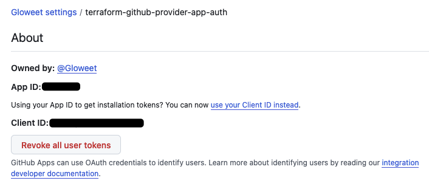

1. In your organization developer's settings, create a new Github App.
Terraform will manage Github using the Github App.

e.g: terraform-github-provider-app-authentication

Add these permissions:
- Administration: Read and write
- Contents: Read and write
- Projects: Read and write
- Variables: Read and write
- Workflows: Read and write
- Members: Read and write

From there, create a secret key, and place the downloaded private key in `live/github_app_pem_file.pem`.

At the top, copy the App ID, fill in `github_app_id` in `live/.auto.tfvars` file.


2. Install the Github App
Still in the developer's settings, go to "Install App" and click "Install".

3. Configure the Github App from your organization's settings.
Go to your organization > Github Apps > Configure
The url looks like this:
```
https://github.com/organizations/<your_org_name>/settings/installations/<installation_id>
```
Copy the installation ID. Fill in `github_app_installation_id` in `live/.auto.tfvars` file.
